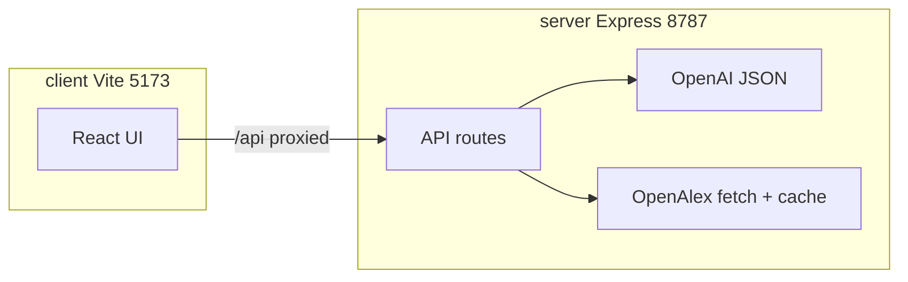

# Architecture — MindGraph + OpenAlex MVP

## Purpose

Web app: user asks a question → **LLM** returns a **graph** (nodes/edges) → **React Flow** mind map → user selects nodes → **deep answer** or **OpenAlex** paper nodes attached → optional **Markdown export**.

## Repo layout (monorepo)

```text
Cursor Hackaton/          ← workspace root (npm workspaces)
├── client/               ← Vite + React + React Flow
├── server/               ← Express BFF, OpenAI, OpenAlex, rate limits
├── package.json          ← npm run dev (client + server)
└── Cursor Hack/          ← this Obsidian vault (this folder)
```

## Data model (shared concept)

- **Node kinds**: `topic`, `keyword`, `subtask`, `paper`, `note`
- **Edge kinds**: `expands_to`, `prerequisite_for`, `from_openalex`, `user_linked`
- **Papers**: store stable OpenAlex work IDs on nodes (see [[OpenAlex]])

## API (Express, default port `8787`)

| Method | Path | Role |
|--------|------|------|
| GET | `/` | Short HTML landing (API is under `/api`) |
| GET | `/api/health` | `llm` / `openAlexMailto` flags |
| POST | `/api/graph/expand` | Question → full graph JSON |
| POST | `/api/graph/expand-selection` | Selected nodes + base graph → **delta** merged |
| POST | `/api/llm/deep` | Markdown answer for selection |
| POST | `/api/graph/attach-papers` | OpenAlex search → `paper` nodes + edges |
| GET | `/api/openalex/works?q=` | Raw search (optional for debugging) |

## Request flow (high level)



## Key files (in repo, outside this vault)

- `server/src/index.ts` — Express app, routes, rate limits
- `server/src/llm.ts` — OpenAI JSON graphs, selection delta merge
- `server/src/openalex.ts` — Works search + disk cache + paper nodes
- `client/src/App.tsx` — UI: question, graph, selection, deep panel
