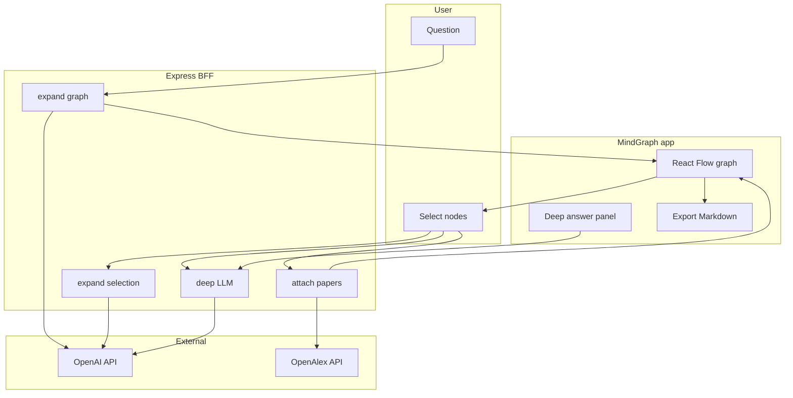
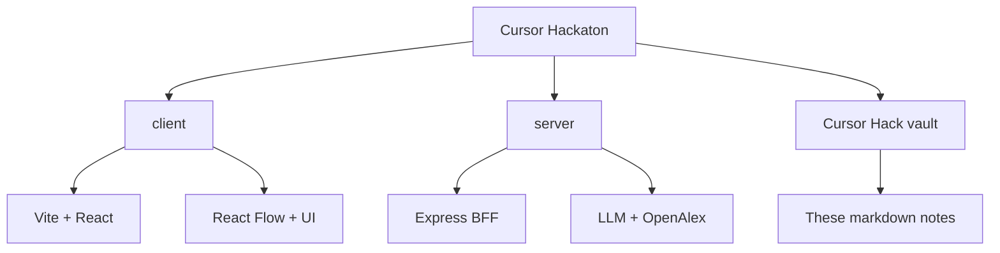

# Visual mindmap (Mermaid)

Turn on **Reading view** in Obsidian for this note so Mermaid renders.

## Product + data flow

## Repo modules (flowchart — works on all Mermaid versions)

## OpenAlex

See also: [[OpenAlex]] (stub for graph links).
