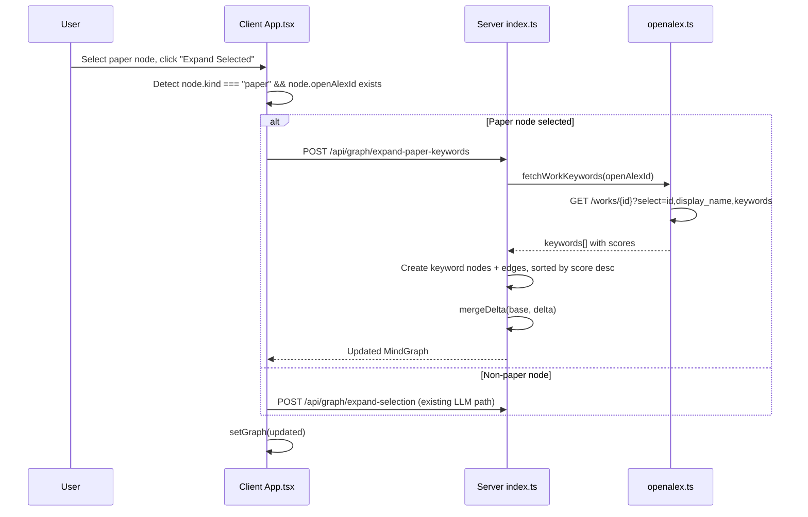

# Expand Paper Keywords via OpenAlex API

## Context

Currently, "Expand Selected" always routes through the LLM (`expandFromSelection` in `llm.ts`). We want a **data-driven** path: when the selected node is a **paper** (which already has an `openAlexId`), fetch its keywords directly from OpenAlex and expand the graph with them -- no LLM call needed.

### Key OpenAlex API detail

A single-work lookup is **free and unlimited** (no API key required, just `mailto` for polite pool):

```
GET /works/{openAlexId}?select=id,display_name,keywords,topics
```

Returns:

```json
{
  "keywords": [
    { "id": "https://openalex.org/keywords/machine-learning", "display_name": "Machine Learning", "score": 0.85 },
    { "id": "https://openalex.org/keywords/neural-networks", "display_name": "Neural Networks", "score": 0.72 }
  ]
}
```

The `score` field (0-1) is the relevance of that keyword to the paper. This is our ordering signal -- **no LLM needed**.

---

## Architecture



---

## Changes by file

### 1. Server: `server/src/openalex.ts`

Add a new function `fetchWorkKeywords` that:

- Calls `GET /works/{openAlexId}?select=id,display_name,keywords` with the existing `mailto` header pattern
- Returns an array of `{ id, displayName, score }` sorted by `score` descending
- Uses the same disk cache pattern as `searchWorks` (24h TTL, keyed by openAlexId)

```typescript
export interface OpenAlexKeyword {
  id: string;
  displayName: string;
  score: number;
}

export async function fetchWorkKeywords(
  openAlexId: string,
  mailto: string | undefined,
): Promise<OpenAlexKeyword[]> { ... }
```

Add a helper `keywordsToGraphNodes` (similar to `workHitToPaperNodes`) that converts the keyword list into `GraphNode[]` and edge targets:

- Node IDs derived from the OpenAlex keyword ID (e.g., `kw_machine-learning`)
- `kind: "keyword"`, `summary` includes the relevance score
- Sorted by score descending
- Cap at ~15 keywords to avoid graph overload

### 2. Server: `server/src/graphTypes.ts`

Add `"has_keyword"` to the `EdgeKind` union to distinguish paper-to-keyword edges from other edge types. Optionally add a `relevance?: number` field to `GraphNode` for downstream sorting/display.

### 3. Server: `server/src/index.ts`

Add route `POST /api/graph/expand-paper-keywords`:

- Body: `{ graph: MindGraph, paperNodeId: string }`
- Looks up the paper node in `graph.nodes` to get its `openAlexId`
- Calls `fetchWorkKeywords(openAlexId, OPENALEX_MAILTO)`
- Converts keywords to nodes + edges using `keywordsToGraphNodes`
- Deduplicates using existing `mergeDelta` from `llm.ts`
- Returns `{ graph: MindGraph }`

### 4. Client: `client/src/graphTypes.ts`

Mirror the same `EdgeKind` and optional `relevance` field changes.

### 5. Client: `client/src/api.ts`

Add a new function:

```typescript
export async function expandPaperKeywords(
  graph: MindGraph,
  paperNodeId: string,
): Promise<{ graph: MindGraph }> {
  return j("/api/graph/expand-paper-keywords", {
    method: "POST",
    body: JSON.stringify({ graph, paperNodeId }),
  });
}
```

### 6. Client: `client/src/App.tsx`

Modify `runExpandSelection` (~line 127):

- Before calling the LLM endpoint, check if **all** selected nodes are papers with an `openAlexId`
- If yes: call `expandPaperKeywords` for each selected paper node (or batch)
- If no: fall through to existing LLM `expandSelection` path

This way the **same button** ("Expand Selected") does the right thing based on node type -- no extra UI needed.

### 7. Client: `client/src/MindNode.tsx` and `client/src/layout.ts`

- `MindNode`: optionally display the relevance score on keyword nodes (e.g., small badge)
- `layout.ts`: add `has_keyword` to edge label rendering; optionally use a different color/style for keyword expansion edges

---

## What we are NOT doing (yet)

- **LLM re-ranking** of keywords against the user's original question (future enhancement)
- **Topics** expansion (4-level hierarchy: domain > field > subfield > topic) -- could be Phase 2
- **Recursive expansion** (keyword -> search works -> expand those works' keywords)
- **Keyword deduplication across papers** beyond ID matching (e.g., synonym merging)
