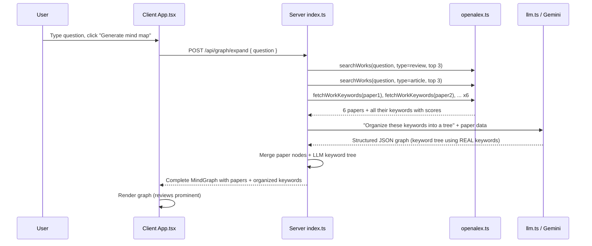

# Hybrid Initial Expansion: OpenAlex-Grounded Mind Map

## Problem

The current "Generate mind map" step is 100% LLM — Gemini invents keywords and subtasks from its training knowledge. This means the graph isn't grounded in real literature and may miss or hallucinate topics.

## Solution

Replace the initial expansion with a **hybrid** approach:

1. Search OpenAlex for **3 review (literature review) papers** + **3 top-cited research articles**
2. Fetch **keywords from each of those 6 papers** via OpenAlex single-work lookup
3. Send all paper titles + keywords to **Gemini**, asking it to **organize and structure** the real keywords into a tree — the LLM does NOT invent keywords, it arranges real ones
4. Include the papers themselves as nodes in the graph, with **reviews visually prominent**

## Key API Details

- OpenAlex `type:review` filter natively identifies literature review papers (4.1M total)
- `sort=cited_by_count:desc` gives the most reliable papers first
- Each work's `keywords` array includes `score` (0-1) for relevance

### Query examples

```
# Top 3 review papers for "federated learning"
GET /works?search=federated+learning&filter=type:review&sort=cited_by_count:desc&per_page=3

# Top 3 cited articles for "federated learning"
GET /works?search=federated+learning&filter=type:article&sort=cited_by_count:desc&per_page=3

# Fetch keywords for a specific paper
GET /works/{openAlexId}?select=id,display_name,keywords
```

## Architecture



## Changes by File

### 1. `server/src/openalex.ts`

- Update `searchWorks` to accept an optional `typeFilter` parameter (`"review"` | `"article"`)
- When provided, add `filter=type:{typeFilter}` to the OpenAlex query
- Also fetch `type` field from OpenAlex results so we know if a paper is a review

### 2. `server/src/llm.ts`

- Add new function `organizeKeywordsToGraph()`:
  - Input: question, list of papers with their keywords
  - Prompt: "Given these papers and their keywords from real research, organize the keywords into a coherent knowledge tree. Do NOT invent new keywords — only use the ones provided."
  - Output: MindGraph with keyword nodes structured as a tree
- Modify `expandQuestionToGraph()` to use the new hybrid pipeline instead of pure LLM generation

### 3. `server/src/index.ts`

- Update the `/api/graph/expand` route to:
  1. Fetch 3 review papers + 3 top-cited articles from OpenAlex
  2. Fetch keywords for each paper
  3. Call `organizeKeywordsToGraph()` with the real data
  4. Merge paper nodes into the graph
  5. Return combined graph

### 4. `server/src/graphTypes.ts` + `client/src/graphTypes.ts`

- Add `"review"` to `NodeKind` to distinguish review papers from regular papers
- Or add `isReview?: boolean` to `GraphNode` (simpler, avoids breaking existing paper logic)

### 5. `client/src/layout.ts`

- Add distinct styling for review paper nodes (e.g., gold/amber border to make them visually prominent)

### 6. `client/src/MindNode.tsx`

- Show "review" badge on review paper nodes

## LLM Prompt Design

The key prompt sent to Gemini will look like:

```
You are organizing real research keywords into a knowledge graph for UI rendering.

Here are papers and their keywords from OpenAlex:

REVIEW PAPERS:
1. "Advances in Federated Learning..." — Keywords: [Federated learning (91%), Privacy (85%), ...]
2. ...

TOP-CITED ARTICLES:
1. "Communication-Efficient Learning..." — Keywords: [Distributed optimization (88%), ...]
2. ...

Rules:
- Create a root "topic" node for the user's question.
- Group and organize the provided keywords into a tree structure.
- DO NOT invent new keywords — only use the ones from the papers above.
- You may merge near-duplicate keywords (e.g., "federated learning" and "Federated Learning").
- Use edges to show hierarchical relationships between keywords.
- Return JSON with nodes and edges.
```

## What We Are NOT Doing (Yet)

- Changing the "Expand Selected" flow (paper keyword expansion stays the same)
- Adding pagination or loading more papers
- Recursive expansion (keyword → more papers → more keywords)
- User controls for adjusting review vs article ratio
